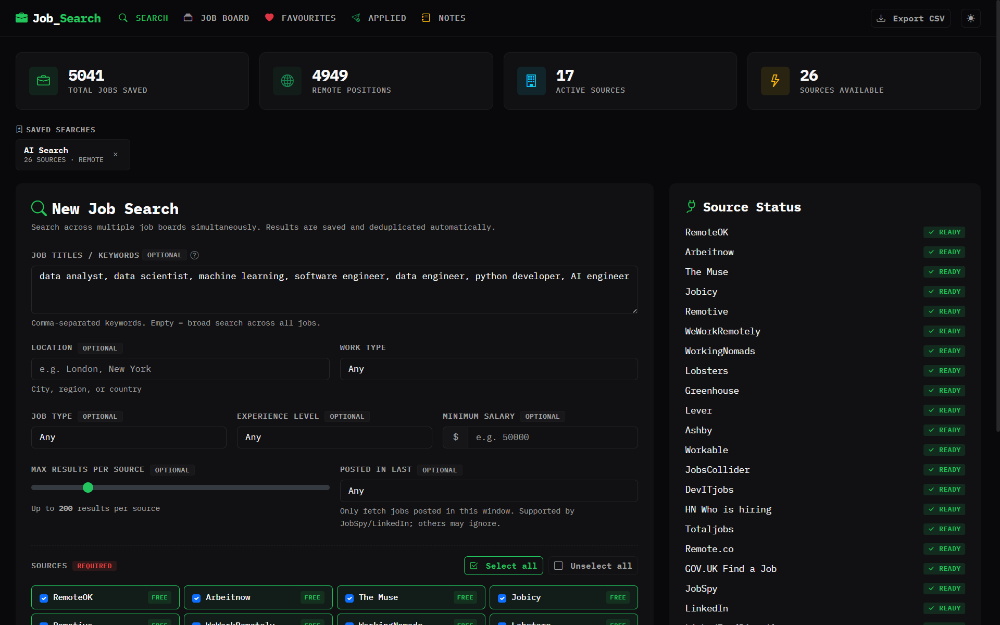
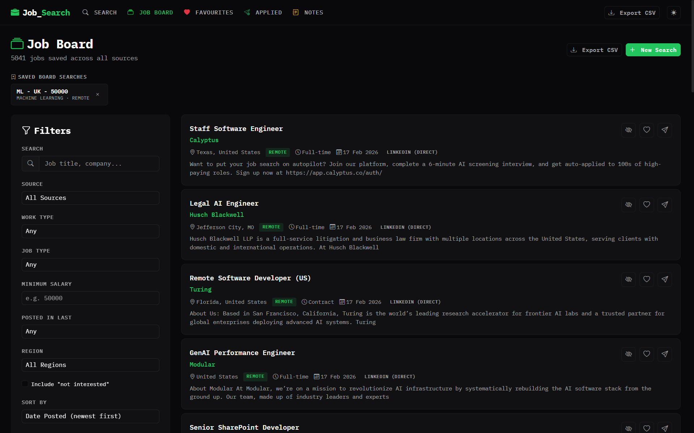
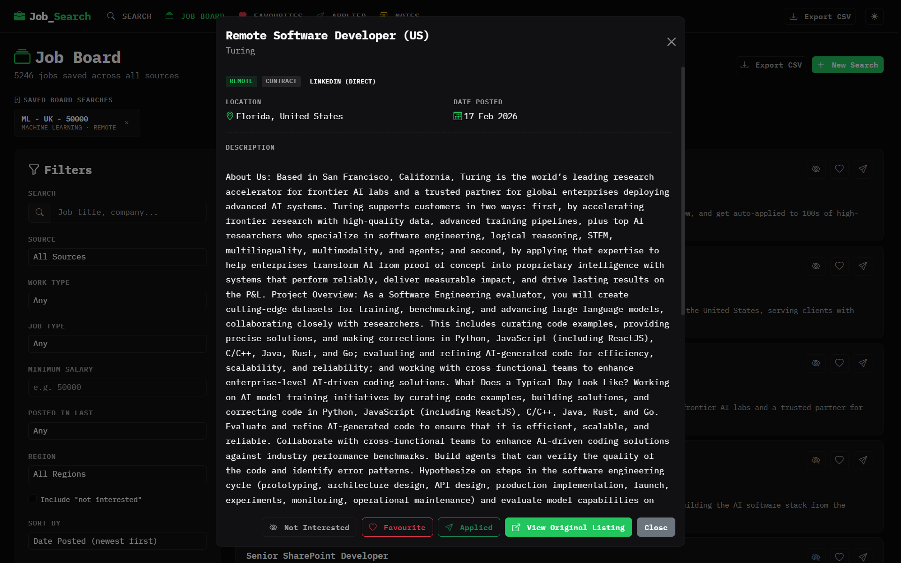
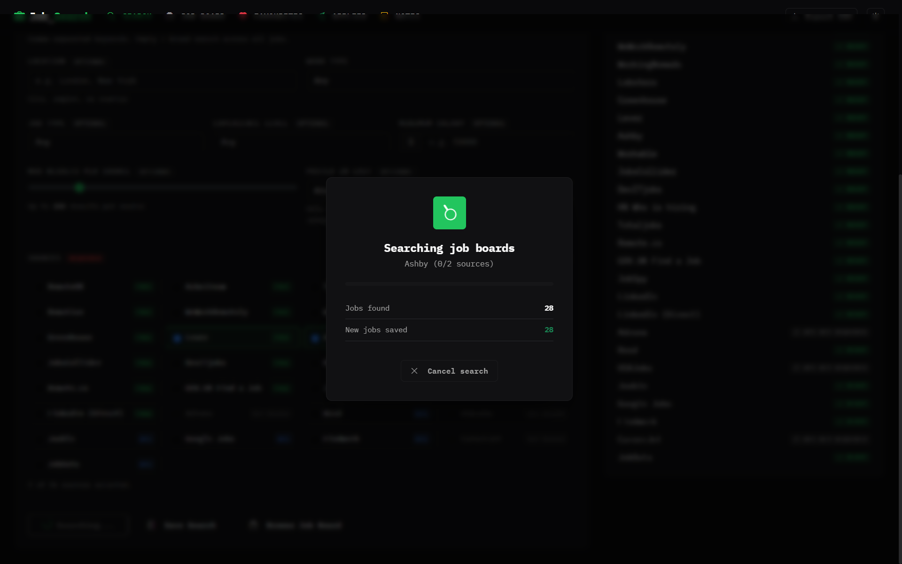
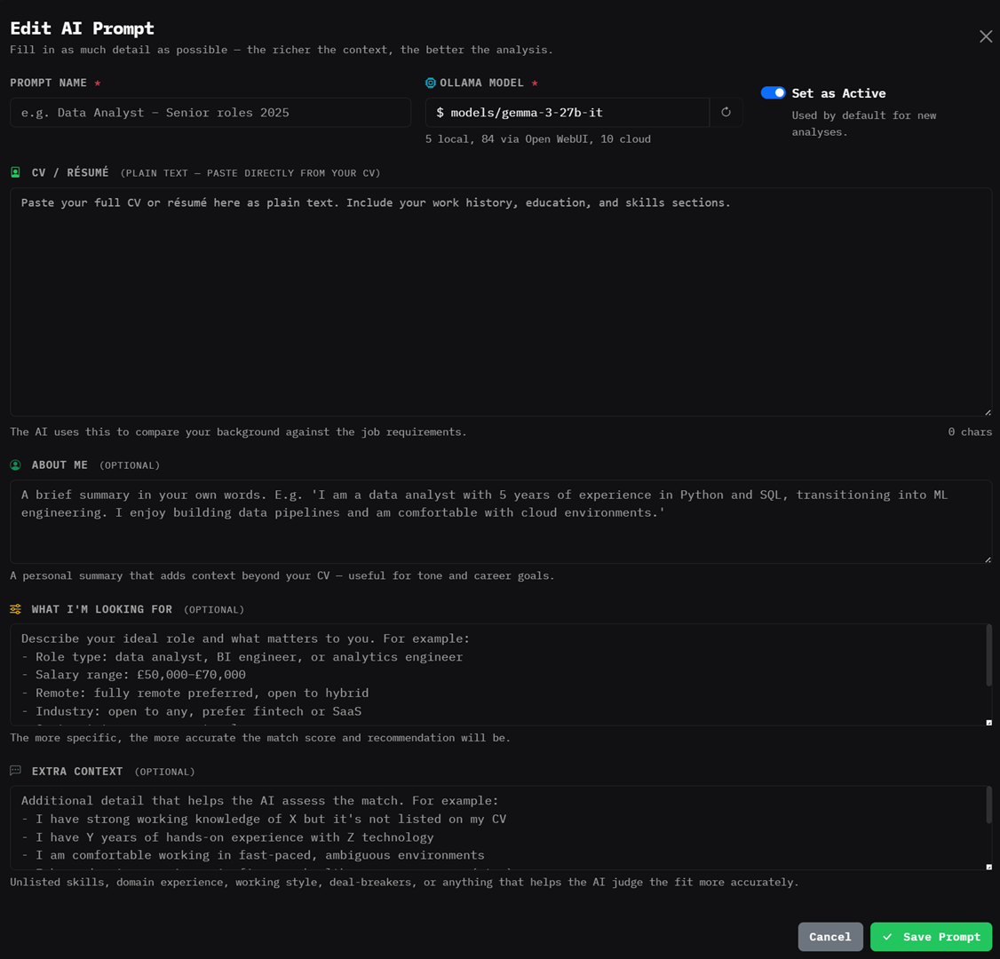
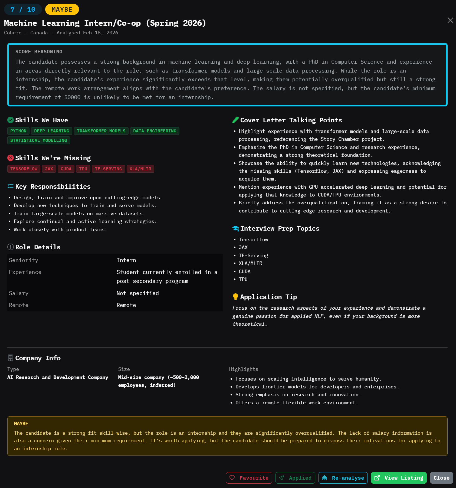

# job_search

I'm currently working full time and job hunting, consequently, my time is valuable and limited. I'm sick of checking the same 10 sites every day, half of them showing me the same listings and the aggregator tools that already exist, want you to pay just to see the results. So I built this instead. Completely free and runs on your local machine

**job_search** pulls from **30+** sources at once: Google Jobs, Indeed, LinkedIn, Glassdoor, UK boards, remote boards, ATS platforms like Greenhouse, Lever, Ashby & Workable, and more. It dumps everything into a MySQL database, deduplicates it, and gives you a clean web UI to browse, filter, favourite, and track your applications. Nothing fancy, just useful.

**job_search** can also analyse job listings against your CV using a local or cloud LLM, including the free tier of Google's Gemini API, which requires no credit card and handles a high volume of analyses at no cost. Feed it your CV, your preferences, and any other context that matters, and for each job it returns:

- **Match score** (1–10) with detailed reasoning
- **Skills you have** and **skills you're missing** for the role
- **Key responsibilities**, what you'd actually be doing day-to-day
- **Cover letter talking points** tailored to your CV and the specific job
- **Interview prep topics** based on gaps in your profile
- **Application tips**, concrete, role-specific advice
- **Red flags**, unusual requirements, vague scope, low salary for seniority, etc.
- **Company highlights**, size, type, funding, notable facts
- **Recommendation**, apply, maybe, or skip

Models run locally via Ollama, through Open WebUI (which proxies Gemini, Claude, and others), or directly via cloud provider APIs. No data leaves your machine unless you explicitly choose a cloud model.

**Important**: **Privacy Notice**. Using external LLMs means your data is no longer private. If you do not want your CV to be used (or potentially used) for training models you should specifically use the local models via Ollama. Alternatively, retract information like your name, address and number from your CV, this will have no impact on the analysis.

**Important**: This is just a side project while I'm actively job hunting, there might be bugs, errors and anything else. Please report anything you find, and I'll do my best to fix them.

Built with Python, Flask, and MySQL. Runs locally on Windows, macOS, or Linux.

## Screenshots

| Dashboard | Job Board |
|:---------:|:---------:|
|  |  |

| Job Detail | Job Search |
|:----------:|:----------:|
|  |  |

| AI Prompt | AI Analysis |
|:----------:|:----------:|
|  |  |

---

## Features

### Multi-Source Aggregation
- **30+ job sources** in one search, free APIs, RSS feeds, web scrapers, Google Jobs, UK government boards, remote-only boards, and ATS company boards (Greenhouse, Lever, Ashby, Workable)
- Each source searches per keyword and merges results, so multiple comma-separated keywords dramatically improve coverage
- Sources run concurrently (thread pool) for fast searches across all boards. However, based on search criteria, this can still take up to an hour

### Database & Deduplication
- All jobs saved to a MySQL database with `INSERT IGNORE` on a unique MD5 hash, safe to re-run searches as many times as you like without creating duplicates
- Jobs are saved as each source finishes (crash-safe), if a search stops mid-run, you keep everything found so far
- Full-text search via a MySQL `FULLTEXT` index on title, company, description, tags, and location

### Professional Web UI
- Clean, modern design inspired by financial terminals, **IBM Plex Mono** font, green accent colour, dark/light theme toggle
- **Instant-apply filters**, no "Apply" button needed; filters update results as you change them
- **Sorting** by date posted, company, title, salary, or source
- **Pagination** with configurable page size
- **Detail modal**, click any job card to see the full description, salary, company logo, and quick-action buttons

### Favourites, Applications & Not Interested
- **Heart icon** to save interesting jobs to a dedicated Favourites page
- **Applied icon** to mark jobs as applied, with optional notes (e.g. "sent CV", "phone screen scheduled")
- **Not Interested icon** (eye-slash) to dismiss jobs you don't want, dimmed on the board, hidden by default via the "Include not interested" filter checkbox
- Dedicated **Favourites** and **Applied** pages for managing your pipeline

### Notes
- **Rich text notes**, create, edit, and delete notes with a full-featured editor (bold, italic, headings, bullet/numbered lists, code blocks, links)
- Perfect for saving great application answers, interview prep, or any job-search-related thoughts
- **Full-text search** across note titles and content
- Powered by [Quill](https://quilljs.com/) rich text editor

### AI Prompts (LLM Analysis)
- **Prompt configurations** bundle your CV, a personal summary, job preferences, and extra context into a reusable config that is sent alongside a job description to a local or cloud LLM
- Create **multiple prompt configs**, e.g. one for senior data roles, one for contract positions, and switch between them freely
- Mark one as **Active** to use it as the default when running analyses
- Each prompt stores:
  - **CV / Résumé**, full plain-text CV pasted directly
  - **About Me**, a short personal summary beyond the CV
  - **What I'm Looking For**, desired role type, salary range, remote preference, location, contract type, and any hard exclusions
  - **Extra Context**, portfolio links, visa status, company-size preference, or any other instructions for the model
  - **Model**, choose from locally installed Ollama models, models available through Open WebUI (e.g. Gemini), or direct cloud APIs (OpenAI, Anthropic, Google)
- Analysis results are stored in `ai_analyses` and linked to both the prompt and the job, re-run with a different model or prompt without losing previous results
- Each analysis returns: keywords, key skills, job description, key responsibilities, match score (1–10) with reasoning, skills matched/missing, cover letter talking points, red flags, interview prep topics, application tips, company type/size/highlights, and a recommendation (apply / maybe / skip)
- **Bulk analysis**: select multiple jobs on the job board, favourites, or applied pages using the checkbox on each card, then click **AI Analyse selected** in the action bar that appears — all jobs are queued in one step using the active prompt (or the prompt picker if no default is set)

### Saved Searches
- **Save any search configuration**, keywords, location, remote, job type, experience level, salary, sources, results cap, and posted-in-last filter
- Saved searches appear as **clickable chips** in a horizontal row above the search form, ordered by most recent
- **Click to load**, instantly populates all form fields and source selections
- **Delete** with the × button on each chip

### Saved Board Searches
- **Save any job board filter configuration**, search query, source, work type, job type, salary, posted-in-last, region, sort, and order
- Saved board searches appear as **clickable chips** above the job board filters, ordered by most recent
- **Click to load**, instantly populates all filter fields and reloads results
- **Delete** with the × button on each chip

### Region Filter
- **Filter by region/country** on the job board, select from 20+ pre-defined regions including United Kingdom, United States, Canada, Germany, France, Netherlands, Ireland, Australia, India, and more
- Handles location data in many formats, "California, United States", "UK", "London", "united kingdom", etc.
- Includes a "Remote / Anywhere" option for jobs listed as worldwide or remote

### Rich Job Descriptions
- Job descriptions from sources **preserve original HTML formatting**, headings, bullet lists, bold text, links, tables, and paragraphs render correctly in the detail modal
- Dangerous elements (script, style, iframe, form) are sanitized on scrape
- Plain-text descriptions fall back to standard rendering

### Search Configuration
- **Keywords**, comma-separated job titles or skills
- **Location**, city, region, or country
- **Remote**, Any / Remote / On-site / Hybrid
- **Job type**, Full-time / Part-time / Contract / Internship / Freelance
- **Experience level**, Entry / Mid / Senior / Lead / Executive
- **Salary minimum**, filter out low-paying roles
- **Source selection**, choose which boards to search
- **Results cap**, limit results per source (25–1000)

### Other
- **Background search** with real-time progress tracking in the UI
- **CSV export**, download your entire job database as a `.csv` file at any time
- **Graceful error handling**, friendly setup instructions displayed when the database is unavailable
- **Extensible architecture**, add new sources via the adapter pattern (extend `BaseSource`, implement `fetch_jobs()`)

---

## Sources

### Free (no API key needed, works immediately)

| Source | Coverage |
|--------|----------|
| RemoteOK | Remote jobs worldwide |
| Arbeitnow | European & global jobs |
| The Muse | US-focused positions |
| Jobicy | Remote jobs worldwide |
| Remotive | Remote tech & non-tech jobs |
| We Work Remotely | Remote jobs (RSS by category) |
| Working Nomads | Remote jobs (API) |
| Lobsters | Lobste.rs job tag (RSS) |
| Greenhouse | Company job boards (Stripe, GitLab, GitHub, etc.) |
| **Lever** | **Company job boards (Netflix, Atlassian, Shopify, etc.), 60+ default boards** |
| **Ashby** | **Company job boards (Anthropic, Deliveroo, Ramp, etc.), 40+ default boards** |
| **Workable** | **Company job boards (Toggl, Hotjar, Wise, etc.), 50+ default boards** |
| JobsCollider | Remote jobs worldwide (API) |
| DevITjobs | UK developer & tech jobs (RSS) |
| HN Who is hiring | Hacker News monthly hiring threads |
| Totaljobs | UK jobs (RSS) |
| Remote.co | Remote jobs (scrape) |
| GOV.UK Find a Job | UK official job board (scrape) |
| **JobSpy** | **Scrapes Indeed, LinkedIn, Glassdoor, ZipRecruiter, Google** |
| **LinkedIn** | **LinkedIn jobs only (via JobSpy scraper; requires python-jobspy)** |
| **LinkedIn (Direct)** | **In-house LinkedIn job search scraper (runs alongside JobSpy; no jobspy needed)** |

### Free API key required (register for free)

| Source | Registration | Coverage |
|--------|-------------|----------|
| Adzuna | [developer.adzuna.com](https://developer.adzuna.com/) | UK, US, AU & more |
| Reed | [reed.co.uk/developers](https://www.reed.co.uk/developers/jobseeker) | UK jobs |
| USAJobs | [developer.usajobs.gov](https://developer.usajobs.gov/APIRequest/Index) | US government jobs |
| Jooble | [jooble.org/api](https://jooble.org/api/about) | Massive global aggregator |
| **Google Jobs** | [serpapi.com](https://serpapi.com/) (100 free/month) | Google's job aggregation engine |
| Findwork | [findwork.dev](https://findwork.dev/developers/) | Developer / tech jobs |
| CareerJet | [careerjet.com/partners/api](https://www.careerjet.com/partners/api) | Job aggregator (1000 calls/hour) |
| **JobData** | [jobdataapi.com](https://jobdataapi.com/docs/) | Job listings with filters; optional key (without key: ~10 req/hour) |

---

## Prerequisites

Before starting, make sure you have these installed:

| Software | Version | Download |
|----------|---------|----------|
| **Python** | 3.10 or newer | [python.org/downloads](https://www.python.org/downloads/) |
| **XAMPP** | Any recent version | [apachefriends.org](https://www.apachefriends.org/download.html) |
| **Git** | Any recent version | [git-scm.com](https://git-scm.com/downloads) |


## Installation & Setup

### Step 1: Install Python

1. Download Python from [python.org/downloads](https://www.python.org/downloads/)
2. **Important (Windows):** During installation, tick the box that says **"Add Python to PATH"**
3. Verify the installation by opening a terminal and running:

```bash
python --version
```

You should see something like `Python 3.12.x`.

### Step 2: Install XAMPP (MySQL)

1. Download XAMPP from [apachefriends.org](https://www.apachefriends.org/download.html) and run the installer
2. You only need **Apache** and **MySQL**, you can uncheck the other components if you like
3. Once installed, open the **XAMPP Control Panel**
4. Click **Start** next to both **Apache** and **MySQL**
5. Both should show a green "Running" status

> **Tip:** If MySQL fails to start, another service may be using port 3306. You can change the port in XAMPP's `my.ini` configuration file.

### Step 3: Create the database

1. Open your browser and go to **[http://localhost/phpmyadmin](http://localhost/phpmyadmin)**
2. Click the **SQL** tab at the top
3. Copy the entire contents of the `database.sql` file from this project and paste it into the SQL box
4. Click **Go**, this creates the `job_search` database, all tables, and seeds the source list

Alternatively, from the command line (XAMPP's MySQL is typically at `C:\xampp\mysql\bin\`):

```bash
mysql -u root < database.sql
```

### Step 4: Clone the repository

```bash
git clone https://github.com/YOUR_USERNAME/job_search.git
cd job_search
```

### Step 5: Create a virtual environment (recommended)

**Windows:**

```bash
python -m venv .venv
.venv\Scripts\activate
```

**macOS / Linux:**

```bash
python3 -m venv .venv
source .venv/bin/activate
```

### Step 6: Install Python dependencies

```bash
pip install -r requirements.txt
```

**Optional**, for Indeed/LinkedIn/Glassdoor/ZipRecruiter scraping via JobSpy:

```bash
pip install python-jobspy
```

**Optional**, for LinkedIn (Direct) browser mode (logged-in scraping with full descriptions):

```bash
pip install playwright
playwright install chromium
```

Then set `LINKEDIN_DIRECT_USE_BROWSER=true` in `.env` and restart the app. On the **Search** page, click **Setup LinkedIn Login** to open a browser window, log in, then click **Continue** to save the session and close the browser. No further `.env` changes are needed after that.

### Step 7: Configure environment variables

```bash
copy .env.example .env
```

(On macOS/Linux use `cp .env.example .env`)

Open `.env` in a text editor and review the settings:

- **Database credentials**, XAMPP defaults (`root` with no password) are pre-filled and should work out of the box
- **API keys**, the 16 free sources work immediately with no keys. To enable additional sources (Adzuna, Reed, etc.), register for free API keys at the links in the table above and paste them into `.env`

### Step 8: Run the application

Make sure your virtual environment is activated and XAMPP's MySQL is running, then:

```bash
python app.py
```

Open **[http://localhost:5000](http://localhost:5000)** in your browser.

### Optional: AI Job Analysis (Local LLM)

The following steps set up a local AI that can read through job listings, compare them against your CV and requirements, and flag which ones are actually worth your time. This is entirely optional, the app works fine without it.

#### Step 9: Install Ollama

Ollama runs AI models locally on your machine with no cloud dependency. Download and run the installer from **[ollama.com](https://ollama.com)**. Once installed, Ollama runs as a background service automatically, no terminal needed to keep it alive.

#### Step 10: Pull models

Download models with `ollama pull` in your terminal. You can have multiple models installed and switch between them freely.

**Text generation** (writing, analysis, coding):

```bash
ollama pull llama3.1
```

**Vision** (image and screenshot analysis):

```bash
ollama pull llava
```

The app talks to Ollama directly via its local API (`http://localhost:11434`), no separate GUI needed.

> **Tip:** Llama 3.1 (8B) runs on most modern machines with 8 GB+ RAM. Larger variants like 70B need significantly more resources, stick with 8B to start.

---

#### Step 11 (Optional): Install Open WebUI for cloud model access

[Open WebUI](https://openwebui.com) is a browser-based interface that sits on top of Ollama and can also connect to external AI providers (Google Gemini, OpenAI, Anthropic, etc.). Once connected, all models, local and cloud, appear together in the job analysis model picker.

**Install and run:**

```bash
pip install open-webui
open-webui serve
```

Open WebUI starts at **http://localhost:8080**. Create an account on first launch (this account stays local to your machine).

---

#### Step 12 (Optional): Connect Google Gemini to Open WebUI

Google's Gemini API has a **generous free tier** (as of early 2026: 1,500 requests/day for Gemini 1.5 Flash, 50 requests/day for Gemini 1.5 Pro, no credit card required). This makes it a good choice for running a high volume of job analyses at no cost.

**Get a free API key:**

1. Go to **[aistudio.google.com](https://aistudio.google.com)**
2. Sign in with your Google account
3. Click **Get API key** → **Create API key**
4. Copy the key, you will paste it into Open WebUI below

**Configure Open WebUI to use Gemini:**

1. Open **http://localhost:8080** in your browser
2. Click your **Profile icon** (bottom-left) → **Settings** → **Connections**
3. Under the **OpenAI API** section, click the **+** button to add a new connection
4. Enter the following:
   - **API URL:** `https://generativelanguage.googleapis.com/v1beta/openai`
   - **API Key:** paste your Google API key
5. Click the **Refresh / Verify** icon (circular arrows). A green checkmark or a populated model list confirms success
6. Click **Save**

Gemini models will now appear in the **Open WebUI, via gateway ($)** group in the job analysis model picker. Despite the `$` label (indicating a cloud model), the free tier is sufficient for most use.

**Connect this app to Open WebUI:**

Add the following to your `.env` file, then restart the app:

```env
OPEN_WEBUI_BASE_URL=http://localhost:8080
OPEN_WEBUI_API_KEY=<your Open WebUI API key>
```

To generate an Open WebUI API key: **Profile icon** → **Settings** → **Account** → **API Keys** → **Create new secret key**. Use this `sk-...` key (not the JWT token shown on the same page).

> **Note:** The app communicates with Open WebUI's API at `http://localhost:8080` and routes all Open WebUI model calls through its OpenAI-compatible endpoint. Your Google API key stays inside Open WebUI, it is never sent directly by this app.


## Usage

1. **Enter keywords**, comma-separated job titles (e.g. `data analyst, python developer, machine learning`). Each source runs one search per keyword and merges results.
2. **Set filters**, location, remote preference, job type, experience level, salary minimum
3. **Select sources**, pick which job boards to search (or leave all selected)
4. **Click Start Search**, the search runs in the background with real-time progress
5. **Browse results** on the **Job Board** page, filter, sort, and click any card for full details
6. **Save favourites** with the heart icon
7. **Mark as applied** with the send icon, add optional notes to track your application pipeline
8. **Export to CSV** from the dashboard at any time

---

## Important Notes

| Topic | Detail |
|-------|--------|
| **ZipRecruiter in the EU** | ZipRecruiter returns 403 (geoblocked-GDPR) from EU IPs. Set `JOBSPY_SITES=...` without `zip_recruiter` in `.env`. |
| **Google 429 (rate limit)** | JobSpy's Google scraping is often rate-limited. The default `JOBSPY_SITES` omits `google`. Add it in `.env` if you want it (expect occasional 429 errors). |
| **JobSpy + LinkedIn** | If both are selected, only JobSpy runs for LinkedIn to avoid a duplicate scrape. |
| **LinkedIn (Direct)** | Uses LinkedIn's jobs-guest API (no JS needed). Time filter: past 24h (`f_TPR=r86400`), past week (`r604800`), past month (`r2592000`). Remote = `f_WT=2`. When no location is set, uses `LINKEDIN_DIRECT_LOCATIONS` from `.env`. |
| **LinkedIn browser mode** | Set `LINKEDIN_DIRECT_USE_BROWSER=true` to open the real LinkedIn page in Playwright. Log in once and the session is saved. Extracts full descriptions, salary, job type, remote status, and company logos. Click **Setup LinkedIn Login** on the Search page to open the browser and log in — no further `.env` edits needed. |
| **JobData API** | Without `JOBDATA_API_KEY` you get ~10 requests/hour (testing). Set the key in `.env` for normal use. Rate limit tracked in `logs/jobdata_ratelimit.json`. |
| **Lever / Ashby / Workable** | Like Greenhouse, these ATS adapters hit public JSON endpoints for a curated list of company boards. Override the default lists with `LEVER_BOARD_TOKENS`, `ASHBY_BOARD_TOKENS`, or `WORKABLE_BOARD_TOKENS` in `.env`. |
| **JobsCollider** | Remote jobs only. Free API, no key needed. Must credit JobsCollider as the source (handled automatically via the `source` field). |
| **DevITjobs** | UK developer/tech jobs via RSS. Free, no key needed. |
| **JobSpy 429/CAPTCHA** | To reduce blocks, the app uses a delay between JobSpy requests (default 8s) and rotates User-Agent headers. Set `JOBSPY_DELAY_BETWEEN_REQUESTS=10` in `.env` for a slower, safer pace. |

---

## File Structure

```
job_search/
├── app.py                              # Flask web application + API routes
├── config.py                           # Configuration (env vars, defaults, DB settings)
├── prompts.py                          # AI analysis system prompt and field validation schema
├── database.sql                        # MySQL schema (paste into phpMyAdmin)
├── requirements.txt                    # Python dependencies
├── .env.example                        # Environment variable template
├── .gitignore                          # Git ignore rules
├── README.md                           # This file
├── data/                               # CSV exports
├── logs/                               # Runtime logs
│   ├── error_log.txt                   # Application warnings/errors
│   ├── llm_requests.log                # Exact prompts sent to Ollama (debug)
│   └── llm_responses.log               # Raw Ollama responses (debug)
├── screenshots/                        # Screenshots for README
├── job_scraper/
│   ├── __init__.py
│   ├── models.py                       # Job data model
│   ├── storage.py                      # MySQL storage (jobs, favourites, applications)
│   ├── manager.py                      # Search orchestrator (threading)
│   └── sources/
│       ├── __init__.py                 # Source registry
│       ├── base.py                     # Abstract base adapter
│       ├── remoteok.py                 # RemoteOK (free)
│       ├── arbeitnow.py               # Arbeitnow (free)
│       ├── themuse.py                  # The Muse (free)
│       ├── jobicy.py                   # Jobicy (free)
│       ├── remotive.py                 # Remotive (free)
│       ├── weworkremotely.py           # We Work Remotely – RSS (free)
│       ├── jobspy_source.py            # JobSpy – Indeed/LinkedIn/etc (free)
│       ├── linkedin.py                 # LinkedIn only (via JobSpy; free)
│       ├── linkedin_direct.py          # LinkedIn in-house scraper
│       ├── adzuna.py                   # Adzuna (API key)
│       ├── reed.py                     # Reed.co.uk (API key)
│       ├── usajobs.py                  # USAJobs (API key)
│       ├── jooble.py                   # Jooble (API key)
│       ├── serpapi_google.py           # Google Jobs via SerpAPI (API key)
│       ├── findwork.py                 # Findwork.dev (API key)
│       ├── jobdata.py                  # JobData API (optional key)
│       ├── careerjet.py                # CareerJet (API key)
│       ├── totaljobs.py               # Totaljobs UK (RSS)
│       ├── remote_co.py               # Remote.co (scrape)
│       ├── govuk_findajob.py          # GOV.UK Find a Job (scrape)
│       ├── greenhouse.py              # Greenhouse company boards
│       ├── lever.py                   # Lever ATS company boards (free)
│       ├── ashby.py                   # Ashby ATS company boards (free)
│       ├── workable.py                # Workable ATS company boards (free)
│       ├── jobscollider.py            # JobsCollider remote jobs (API)
│       ├── devitjobs.py               # DevITjobs UK tech jobs (RSS)
│       ├── workingnomads.py           # Working Nomads (API)
│       ├── lobsters.py                # Lobste.rs jobs (RSS)
│       └── hn_hiring.py               # HN Who is hiring (scrape)
├── templates/
│   ├── base.html                       # Base layout (navbar, modal, scripts)
│   ├── index.html                      # Dashboard – search form + stats
│   ├── jobs.html                       # Job board – browse, filter, detail
│   ├── favourites.html                 # Saved/favourite jobs
│   ├── applied.html                    # Jobs marked as applied
│   ├── notes.html                      # Notes – rich text editor (Quill)
│   ├── ai_prompts.html                 # AI Prompt configurations page
│   └── error.html                      # Database connection error page
└── static/
    ├── css/
    │   └── style.css                   # Custom styles (IBM Plex Mono, dark/light, green accent)
    └── js/
        ├── app.js                      # Frontend logic (search, filters, modal, fav/applied)
        └── ai_analyse.js               # AI analysis queue (single + bulk), prompt picker, toast notifications
```

---

## Database Schema

### `sources` (reference table)

| Column | Type | Description |
|--------|------|-------------|
| `id` | INT (PK) | Auto-increment primary key |
| `name` | VARCHAR(100) | Source name (unique) |
| `website` | VARCHAR(512) | Source website URL |
| `requires_api_key` | TINYINT | Whether an API key is needed |
| `is_free` | TINYINT | Whether the source is free |
| `created_at` | DATETIME | When the record was created |

Pre-seeded with all 29 configured sources on database creation.

### `jobs`

| Column | Type | Description |
|--------|------|-------------|
| `id` | INT (PK) | Auto-increment primary key |
| `job_id` | VARCHAR(64) | MD5 hash for deduplication (unique) |
| `title` | VARCHAR(512) | Job title |
| `company` | VARCHAR(255) | Company name |
| `location` | VARCHAR(255) | Job location |
| `description` | MEDIUMTEXT | Full job description |
| `url` | VARCHAR(2048) | Application / listing URL |
| `source` | VARCHAR(100) | Source name |
| `remote` | VARCHAR(50) | Remote / On-site / Hybrid / Unknown |
| `salary_min` | DECIMAL(12,2) | Minimum salary |
| `salary_max` | DECIMAL(12,2) | Maximum salary |
| `salary_currency` | VARCHAR(10) | Currency code |
| `job_type` | VARCHAR(50) | Full-time, Part-time, Contract, etc. |
| `experience_level` | VARCHAR(50) | Entry, Mid, Senior, Lead, Executive |
| `date_posted` | VARCHAR(50) | Date posted by the source |
| `date_scraped` | DATETIME | When the job was scraped |
| `tags` | TEXT | Comma-separated tags |
| `company_logo` | VARCHAR(2048) | Logo URL |

Indexes: `source`, `remote`, `job_type`, `date_scraped`, `date_posted`, and a `FULLTEXT` index on `title`, `company`, `description`, `tags`, `location`.

### `favourites`

| Column | Type | Description |
|--------|------|-------------|
| `id` | INT (PK) | Auto-increment primary key |
| `job_id` | VARCHAR(64) | FK to `jobs.job_id` (unique, CASCADE delete) |
| `created_at` | DATETIME | When the job was favourited |

### `applications`

| Column | Type | Description |
|--------|------|-------------|
| `id` | INT (PK) | Auto-increment primary key |
| `job_id` | VARCHAR(64) | FK to `jobs.job_id` (unique, CASCADE delete) |
| `applied_at` | DATETIME | When the application was recorded |
| `notes` | TEXT | Optional notes (e.g. "sent CV", "phone screen") |

### `not_interested`

| Column | Type | Description |
|--------|------|-------------|
| `id` | INT (PK) | Auto-increment primary key |
| `job_id` | VARCHAR(64) | FK to `jobs.job_id` (unique, CASCADE delete) |
| `created_at` | DATETIME | When the job was marked not interested |

### `notes`

| Column | Type | Description |
|--------|------|-------------|
| `id` | INT (PK) | Auto-increment primary key |
| `title` | VARCHAR(255) | Note title |
| `body` | MEDIUMTEXT | Rich text content (HTML) |
| `created_at` | DATETIME | When the note was created |
| `updated_at` | DATETIME | When the note was last updated (auto-updates) |

Indexes: `FULLTEXT` index on `title` and `body`.

### `saved_searches`

| Column | Type | Description |
|--------|------|-------------|
| `id` | INT (PK) | Auto-increment primary key |
| `name` | VARCHAR(255) | User-defined name for the search |
| `params` | JSON | All search parameters (keywords, location, sources, etc.) |
| `created_at` | DATETIME | When the search was saved |
| `updated_at` | DATETIME | When the search was last updated (auto-updates) |

### `saved_board_searches`

| Column | Type | Description |
|--------|------|-------------|
| `id` | INT (PK) | Auto-increment primary key |
| `name` | VARCHAR(255) | User-defined name for the board search |
| `params` | JSON | All board filter parameters (query, source, remote, job type, etc.) |
| `created_at` | DATETIME | When the board search was saved |
| `updated_at` | DATETIME | When the board search was last updated (auto-updates) |

### `ai_prompts`

Reusable AI analysis configurations. Each prompt bundles the user's CV and preferences so they can be combined with any job description at analysis time.

| Column | Type | Description |
|--------|------|-------------|
| `id` | INT (PK) | Auto-increment primary key |
| `title` | VARCHAR(255) | Human-readable name for this configuration |
| `model` | VARCHAR(100) | Ollama model to use (e.g. `llama3.1`) |
| `cv` | MEDIUMTEXT | Full CV / résumé as plain text |
| `about_me` | TEXT | Personal summary / bio |
| `preferences` | TEXT | Desired role type, salary, remote preference, exclusions, etc. |
| `extra_context` | TEXT | Portfolio links, visa status, company-size preference, or any other instructions |
| `is_active` | TINYINT | 1 = default prompt used for new analyses |
| `created_at` | DATETIME | When the prompt was created |
| `updated_at` | DATETIME | When the prompt was last updated (auto-updates) |

### `ai_analyses`

Stores the structured JSON output from running an AI prompt against a job listing.

| Column | Type | Description |
|--------|------|-------------|
| `id` | INT (PK) | Auto-increment primary key |
| `job_id` | VARCHAR(64) | FK to `jobs.job_id` (CASCADE delete) |
| `prompt_id` | INT | FK to `ai_prompts.id` (CASCADE delete) |
| `model` | VARCHAR(100) | Ollama model used (e.g. `llama3.1`) |
| `result` | JSON | Structured LLM output (keywords, skills, match score, recommendation, etc.) |
| `created_at` | DATETIME | When the analysis was run |

Unique constraint on `(job_id, prompt_id)`, one analysis result per job per prompt config.

---

## API Endpoints

### Jobs & Search

| Method | Endpoint | Description |
|--------|----------|-------------|
| `POST` | `/api/search` | Start a new background search |
| `GET` | `/api/search/<id>` | Poll search task progress |
| `POST` | `/api/search/<id>/cancel` | Cancel a running search |
| `POST` | `/api/linkedin/setup` | Open headed browser for LinkedIn login (browser mode only) |
| `GET` | `/api/linkedin/setup/<id>` | Poll LinkedIn login setup task status |
| `POST` | `/api/linkedin/setup/<id>/complete` | Signal the browser to close and save the session |
| `GET` | `/api/jobs` | Query saved jobs (supports filters + pagination) |
| `GET` | `/api/jobs/<id>` | Get single job detail (includes fav/applied status) |
| `POST` | `/api/jobs/statuses` | Bulk check favourite/applied status for job IDs |
| `GET` | `/api/stats` | Summary statistics (includes fav/applied counts) |
| `GET` | `/api/sources` | Available sources with status |
| `GET` | `/api/export` | Download CSV export |

### Favourites

| Method | Endpoint | Description |
|--------|----------|-------------|
| `GET` | `/api/favourites` | List all favourite jobs |
| `POST` | `/api/favourite/<job_id>` | Add a job to favourites |
| `DELETE` | `/api/favourite/<job_id>` | Remove a job from favourites |

### Applications

| Method | Endpoint | Description |
|--------|----------|-------------|
| `GET` | `/api/applications` | List all applied jobs |
| `POST` | `/api/applied/<job_id>` | Mark a job as applied (accepts `notes` in body) |
| `DELETE` | `/api/applied/<job_id>` | Remove application status |
| `PUT` | `/api/applied/<job_id>/notes` | Update application notes |

### Not Interested

| Method | Endpoint | Description |
|--------|----------|-------------|
| `POST` | `/api/not-interested/<job_id>` | Mark a job as not interested |
| `DELETE` | `/api/not-interested/<job_id>` | Remove not interested status |

### Regions

| Method | Endpoint | Description |
|--------|----------|-------------|
| `GET` | `/api/regions` | List available region labels for filtering |

### Saved Searches

| Method | Endpoint | Description |
|--------|----------|-------------|
| `GET` | `/api/saved-searches` | List all saved searches |
| `POST` | `/api/saved-searches` | Save a search (accepts `name`, `params`) |
| `GET` | `/api/saved-searches/<id>` | Get a single saved search |
| `PUT` | `/api/saved-searches/<id>` | Update a saved search |
| `DELETE` | `/api/saved-searches/<id>` | Delete a saved search |

### Saved Board Searches

| Method | Endpoint | Description |
|--------|----------|-------------|
| `GET` | `/api/saved-board-searches` | List all saved board searches |
| `POST` | `/api/saved-board-searches` | Save a board search (accepts `name`, `params`) |
| `GET` | `/api/saved-board-searches/<id>` | Get a single saved board search |
| `PUT` | `/api/saved-board-searches/<id>` | Update a saved board search |
| `DELETE` | `/api/saved-board-searches/<id>` | Delete a saved board search |

### Notes

| Method | Endpoint | Description |
|--------|----------|-------------|
| `GET` | `/api/notes` | List all notes (supports `q` search param) |
| `POST` | `/api/notes` | Create a new note (accepts `title`, `body`) |
| `GET` | `/api/notes/<id>` | Get a single note |
| `PUT` | `/api/notes/<id>` | Update a note (accepts `title`, `body`) |
| `DELETE` | `/api/notes/<id>` | Delete a note |

### AI Prompts

| Method | Endpoint | Description |
|--------|----------|-------------|
| `GET` | `/api/ai-prompts` | List all AI prompt configurations |
| `POST` | `/api/ai-prompts` | Create a new prompt (accepts `title`, `cv`, `about_me`, `preferences`, `extra_context`, `is_active`) |
| `GET` | `/api/ai-prompts/<id>` | Get a single prompt |
| `PUT` | `/api/ai-prompts/<id>` | Update a prompt |
| `DELETE` | `/api/ai-prompts/<id>` | Delete a prompt |
| `POST` | `/api/ai-prompts/<id>/activate` | Set a prompt as the active default |
| `GET` | `/api/ollama/models` | List available models, local Ollama, Open WebUI (Gemini etc.), and direct cloud APIs |
| `POST` | `/api/ai-analyse` | Run an AI analysis of a job (accepts `job_id`, `prompt_id`; calls Ollama, validates, persists result) |
| `GET` | `/api/ai-analyses/<job_id>` | Return all AI analyses previously run for a job |

---

## Search Parameters

| Parameter | Type | Description |
|-----------|------|-------------|
| `keywords` | string | Comma-separated job titles / keywords |
| `location` | string | City, region, or country |
| `remote` | string | Any / Remote / On-site / Hybrid |
| `job_type` | string | Full-time / Part-time / Contract / Internship / Freelance |
| `experience_level` | string | Entry / Mid / Senior / Lead / Executive |
| `salary_min` | number | Minimum annual salary |
| `sources` | list | Which sources to query |
| `max_results_per_source` | number | Cap per source (default 1000) |
| `posted_in_last_days` | number | Only return jobs posted within N days |

---

## Adding a New Source

1. Create a new file in `job_scraper/sources/` (e.g. `my_source.py`)
2. Extend `BaseSource` and implement `fetch_jobs()`. Use `normalize_keywords(keywords)` from `base` to get a list of search terms, run one request per term and merge/dedupe results.
3. Register it in `job_scraper/sources/__init__.py` (add to `ALL_SOURCES` and the appropriate list)
4. If it needs an API key, add the config var to `config.py` and `.env.example`
5. Add it to the `sources` table in `database.sql`

---

## Troubleshooting

| Problem | Solution |
|---------|----------|
| **"Database unavailable" error page** | Make sure XAMPP's MySQL is running (green status in XAMPP Control Panel). Check that `.env` has the correct `DB_HOST`, `DB_PORT`, `DB_USER`, and `DB_PASSWORD`. |
| **MySQL won't start in XAMPP** | Another service may be using port 3306. Open XAMPP Config > `my.ini` and change the port, or stop the conflicting service. |
| **`pip install` fails** | Make sure Python is on your PATH and you're in the virtual environment (`.venv\Scripts\activate` on Windows). |
| **No results from a source** | Some sources require API keys, check `.env`. JobSpy requires `pip install python-jobspy`. |
| **JobSpy returns 429 / CAPTCHA** | Increase `JOBSPY_DELAY_BETWEEN_REQUESTS` in `.env` (e.g. `10` or `15`). Google is often rate-limited, the default config omits it. |
| **ZipRecruiter 403 in EU** | Remove `zip_recruiter` from `JOBSPY_SITES` in `.env`, it's geoblocked under GDPR. |
| **LinkedIn (Direct) returns no results** | LinkedIn's guest API can be rate-limited. Increase `LINKEDIN_DIRECT_DELAY` in `.env`. Or enable browser mode for better results. |
| **`playwright` errors** | Run `playwright install chromium` after `pip install playwright`. |

---

## Tech Stack

- **Backend:** Python 3.10+, Flask
- **Database:** MySQL (MariaDB via XAMPP)
- **Frontend:** HTML, CSS, vanilla JavaScript
- **Font:** IBM Plex Mono (Google Fonts)
- **Scraping:** Requests, BeautifulSoup, Feedparser, python-jobspy (optional), Playwright (optional)

---

## License

This project is provided as-is for personal use. See [LICENSE](LICENSE) for details.
